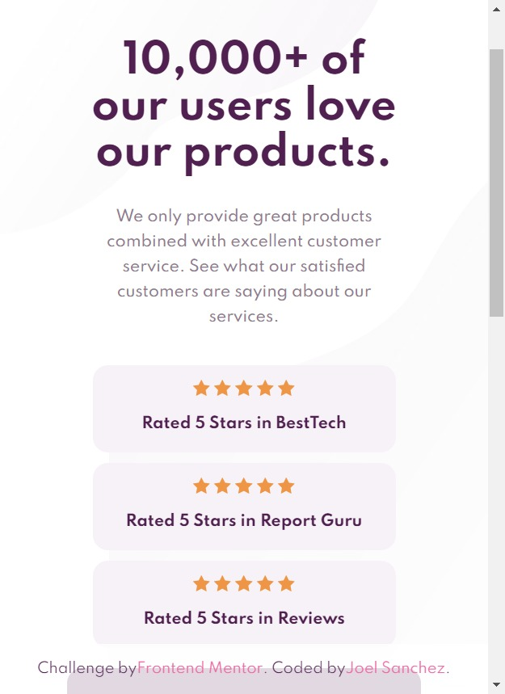
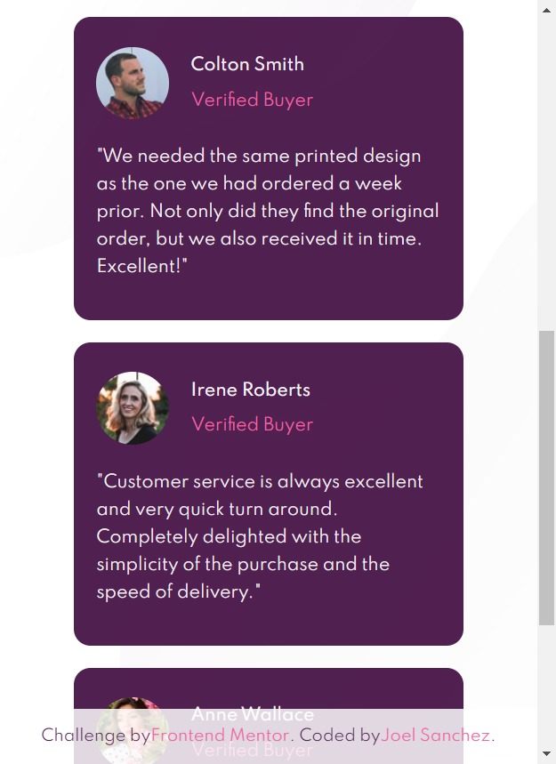
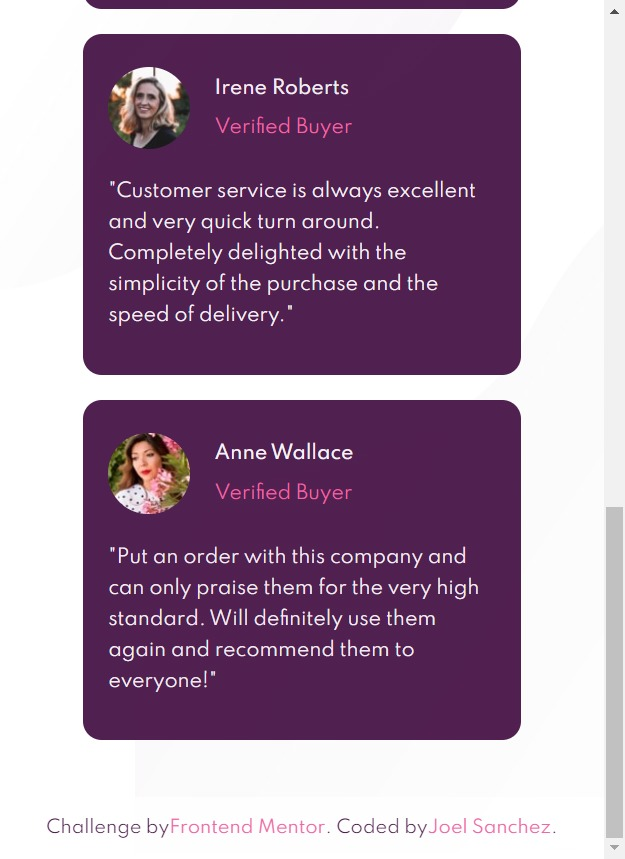
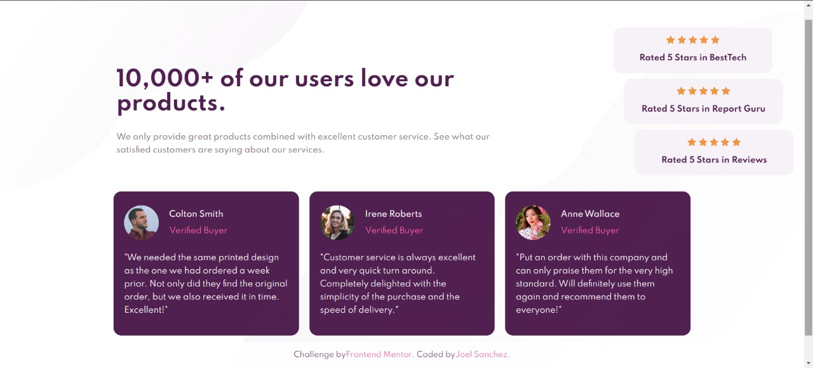

# Frontend Mentor - Social proof section solution

## Table of contents

- [Overview](#overview)
  - [The challenge](#the-challenge)
  - [Screenshot](#screenshot)
- [My process](#my-process)
  - [Built with](#built-with)
  - [Author](#author)
## Overview

### The challenge

Users should be able to:

- View the optimal layout for the section depending on their device's screen size

### Screenshot

Mobile

Desktop

## My process

### Built with

- Semantic HTML5 markup
- BEM Methodology
- Flexbox
- Mobile-first workflow

## Author

- Youtube - [JGame&Code](https://www.youtube.com/channel/UC-U-_y5Vz01kKodj78AwmEQ)